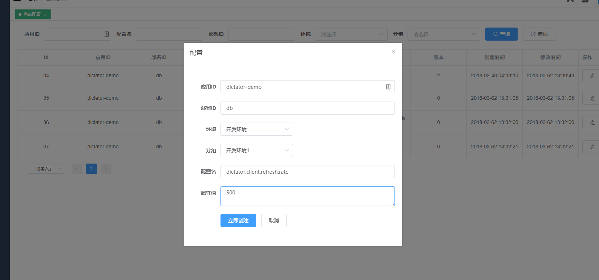

# 设计机制

## 基本思路

客户端是配置的使用者，服务端是提供者。zk/redis/mysql是配置的持久化提供者


client通过http协议请求server，server先检查缓存提供者（zk/redis）是否存在，不存在就用默认提供的MySQL实现获取配置。
为了防止客户端请求频率过快，穿透缓存，dictator采用定时刷新的方式同步数据库和缓存的配置数据

## 服务端
### 基本配置
### 配置历史
### 分组

## 客户端
### 客户端标识

由于服务端只是配置的提供者，并不知道客户端需要的配置都是那些，dictator要求客户端需要配置
```properties
appId=app #应用ID代码
profile=dev #环境代码（开发环境、测试环境、生产环境）
serverUrl=http://localhost:3399 #dictator服务端的地址
```
>serverUrl、appId和profile都是客户端必须的配置。

### 拉取策略

为了稳定的提供服务，dictator使用HTTP协议定时拉取配置，默认频率是1S每次。客户端在请求时加入参数上一次成功同步配置的时间毫秒数，服务端按照时间对比，只返回上次同步之后新增的配置。

### 配置刷新

如果你需要修改频率，可以登录配置中心管理台增加配置


>dictator在spring启动时就已经注入配置，所以我们可以在配置中心管理Spring的所有配置，包括客户端本身！